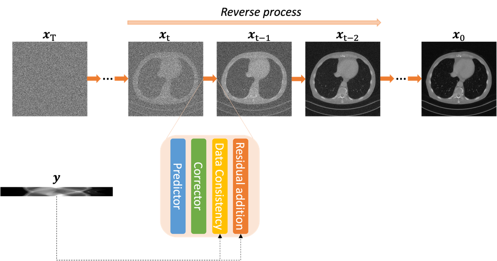

# Residual-Guidance Diffusion Model for Sparse-View CT Reconstuction  



> 
>**Abstract**: <br>
Sparse-view Computed Tomography (CT) is a low-dose CT imaging strategy that acquires projections by intermittently turning the X-ray power on and off. This not only reduces radiation exposure to patients but also possibly shortens the data acqui-sition time. However, due to limited data sampling, applying analytic reconstruction algorithms like FBP results in severe streak artifacts, posing challenges for diagnosis. To address this issue, various deep-learning methods have emerged for sparse-view CT reconstruction. Unfortunately, most existing approaches adopt a supervised manner, using streak artifact-corrupted images or sparsely sampled sinograms as input and streak artifact-free images or fully sampled sinograms as ground truth. This limits their practical application in clinical settings. Recently, diffusion models, recog-nized as state-of-the-art generative techniques, have demonstrated promising per-formance in solving inverse problems in various medical imaging tasks. In this paper, we propose a residual guidance score-based diffusion model for sparse-view CT re-construction. Initially, we unconditionally train the score-based diffusion model using CT images without streak artifacts. During inference, we iteratively introduce addi-tional residual information following the reverse diffusion step and data consistency step to preserve structural details. Both qualitative and quantitative assessments confirm the superiority of our method over previous approaches, yielding promising results.

Run the following command.
```
python run_CT_recon.py
```

Code is heavily based on [MCG](https://github.com/HJ-harry/MCG_diffusion). 
We highly appreciate your support for sharing code.
